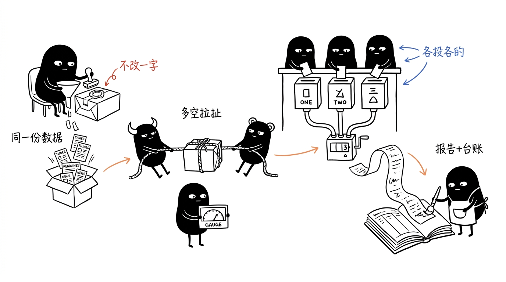
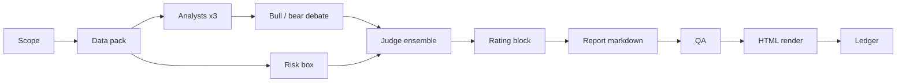

# trading-research

[](#install)
[](#requirements)
[](#disclaimer)
[](#safeguards)

Audit-first trading research for Claude Code: one ticker in, one cited,
adversarial, position-aware memo out.

The unique strength is discipline over spectacle. Instead of presenting a broad
agent framework, named investor personas, or a simulated fund, this skill turns
every run into auditable artifacts: a sealed data pack, fact-tagged numbers,
independent analyst briefs, a bull/bear debate, a computed risk box, a blind
N=3-5 judge vote, deterministic QA, and a look-ahead-safe ledger.

Ask for `/trading-research NVDA`. The skill builds the evidence first, makes the
agents argue from the same source material, publishes the vote distribution, and
keeps your actual position out of the rating path.

It is not an autotrader. It never places orders. It exists to make the model
show its evidence, publish dissent, and keep score.

<p align="center">
  
</p>

## How It Differs

Popular community finance-agent projects prove that multi-agent research
workflows are compelling. This repo is narrower and more personal: it is a local
research desk for one investor, one ticker, one decision at a time.

| If you like... | This repo emphasizes... |
| --- | --- |
| Multi-agent trading frameworks | A portable Claude Code skill with durable run artifacts |
| AI fund simulations | A decision memo, not a simulated fund or order engine |
| Agent debates | Published bull/bear disagreement and judge vote distribution |
| Automated recommendations | Fail-loud citations, explicit data gaps, and a NO-CALL path |
| Portfolio context | Position-aware framing while keeping the rating position-blind |

## What You Get

| Capability | What it does |
| --- | --- |
| Sealed data pack | Schwab price/technicals, EDGAR fundamentals, headlines, Tiingo cross-checks, optional options data, and optional position facts. |
| Cited numbers | Report numbers must point to `[P#.fact]` tags or URLs; untagged numbers fail QA. |
| Adversarial workflow | Fundamental, technical, and sentiment analysts brief independently; bull and bear researchers then attack each case. |
| Judge ensemble | Three judges vote first; wide disagreement escalates to five; irreconcilable spread publishes as NO-CALL. |
| Computed risk box | `risk_box.py` calculates adverse move, volatility context, and invalidation anchors before the writer touches the report. |
| Options X-ray | `--options` adds Unusual Whales gamma, IV, skew, max pain, OI walls, and flow context without changing the equity rating. |
| Position-aware report | SnapTrade or Schwab can add holdings, P/L, and action framing; analysts and judges never see position data. |
| HTML output | Markdown is canonical; `render_report.py` produces a self-contained styled HTML deliverable. |
| Track record | `ledger.py` appends every report and filters history by `as_of` to avoid look-ahead leakage. |

## Quick Demo

```text
/trading-research NVDA
```

Expected output:

- `runs/NVDA-<date>-<hhmm>/10-datapack.{md,json}`
- `runs/NVDA-<date>-<hhmm>/50-votes/vote-*.md`
- `runs/NVDA-<date>-<hhmm>/60-report.md`
- `runs/NVDA-<date>-<hhmm>/60-report.html`
- one guarded row in your configured `ledger.jsonl`

## Install

### Requirements

- [Claude Code](https://claude.com/claude-code) with subagent-capable usage.
- Python 3.13.
- Your own market-data credentials.

### Clone

For Claude Code's default skill root:

```bash
git clone https://github.com/zjh08177/trading-research-skill.git \
  ~/.claude/skills/trading-research
cd ~/.claude/skills/trading-research
scripts/setup_venv.sh
```

If your agent runtime uses a different skill root, clone the same repo there
instead, for example `~/.agents/skills/trading-research`.

### Configure Credentials

Create a private config directory and point the vendor CLIs at it:

```bash
mkdir -p ~/.config/trading-research
chmod 700 ~/.config/trading-research

export TRADING_RESEARCH_VENDORS_ENV=~/.config/trading-research/vendors.env
export UNUSUALWHALES_ENV=~/.config/trading-research/unusualwhales.env
export SNAPTRADE_ENV=~/.config/trading-research/snaptrade.env
```

`~/.config/trading-research/vendors.env`:

```bash
# Required for the main equity path.
SCHWAB_CLIENT_ID=...
SCHWAB_CLIENT_SECRET=...
SCHWAB_TOKEN_PATH=~/.config/trading-research/schwab_token.json

# Required by SEC EDGAR; this is a contact string, not a paid key.
SEC_EDGAR_USER_AGENT="Name email@example.com"

# Optional.
TIINGO_API_KEY=...
MARKETAUX_API_KEY=...
```

Optional options data:

```bash
# ~/.config/trading-research/unusualwhales.env
UNUSUAL_WHALES_API_KEY=...
```

Optional position-aware reporting:

```bash
# ~/.config/trading-research/snaptrade.env
SNAPTRADE_CLIENT_ID=...
SNAPTRADE_CONSUMER_KEY=...
SNAPTRADE_USER_ID=...
SNAPTRADE_USER_SECRET=...
```

Set the ledger path:

```bash
export TRADING_RESEARCH_LEDGER=~/trading-reports/ledger.jsonl
```

## Usage

```text
/trading-research NVDA                 # full single-ticker memo
/trading-research MRVL --options       # add dealer-positioning context
/trading-research MRVL --options-only  # zero-LLM options audit, no rating
/trading-research --evolve             # local usage retrospective
```

Reports render as styled HTML plus canonical markdown. Run artifacts live under
`runs/<TICKER>-<date>-<hhmm>/`; final reports copy to your reports vault.

## Pipeline



Every stage writes an artifact. The next stage reads artifacts, not summaries.
That is the core design choice.

## Data Sources

| Source | Used for | Required |
| --- | --- | --- |
| Schwab | Live quote, bars, technicals, light options, optional account position | Yes |
| SEC EDGAR | Fundamentals and share-count-derived market cap | Yes |
| Tiingo | Out-of-band price cross-check | Optional |
| Marketaux | Dated headlines | Optional |
| Unusual Whales | Dealer positioning and options flow for `--options` | Optional, paid |
| SnapTrade | Cross-broker read-only position context | Optional |

Skipped optional sources become named Data Gaps. They do not silently vanish.

## Safeguards

- The headline rating only comes from `ensemble.py`, never from one agent.
- Judges receive byte-identical inputs.
- Position facts are withheld from analysts, debate, risk, and judges.
- Broker CLIs are read-only and do not reference order or trade endpoints.
- Dead data sources become `MISSING(...)` or `DEGRADED(...)`.
- Report numbers need cited fact tags or URLs.
- Ledger reads filter `date_utc < as_of`.
- HTML is rendered deterministically from the QA'd markdown.

## Repo Map

```text
SKILL.md                    # Pipeline contract and invariants
references/                 # Role cards and report template
scripts/                    # Tally, QA, ledger, render, risk, usage helpers
scripts/vendors/            # Schwab, EDGAR, Tiingo, Marketaux, UW, SnapTrade CLIs
scripts/batch/              # Portfolio and batch reference workflows
hosts/cursor-command.md     # Cursor host command mapping
tests/                      # Contract and regression tests
```

## Development

```bash
cd ~/.claude/skills/trading-research
.venv/bin/python -m pytest tests
```

The tests focus on the workflow contracts: ensemble behavior, ledger guards,
QA checks, render consistency, options wiring, position isolation, and read-only
broker access.

## Project Status

This is a personal v2 decision-support skill. The single-ticker report path is
the primary supported workflow. Batch and portfolio scripts are useful reference
drivers, but some assume the author's local reports-vault layout.

No license file is currently included.

## Disclaimer

This project is for research and decision support only. It is not financial,
investment, tax, or trading advice. You are responsible for every decision and
every order you place.
